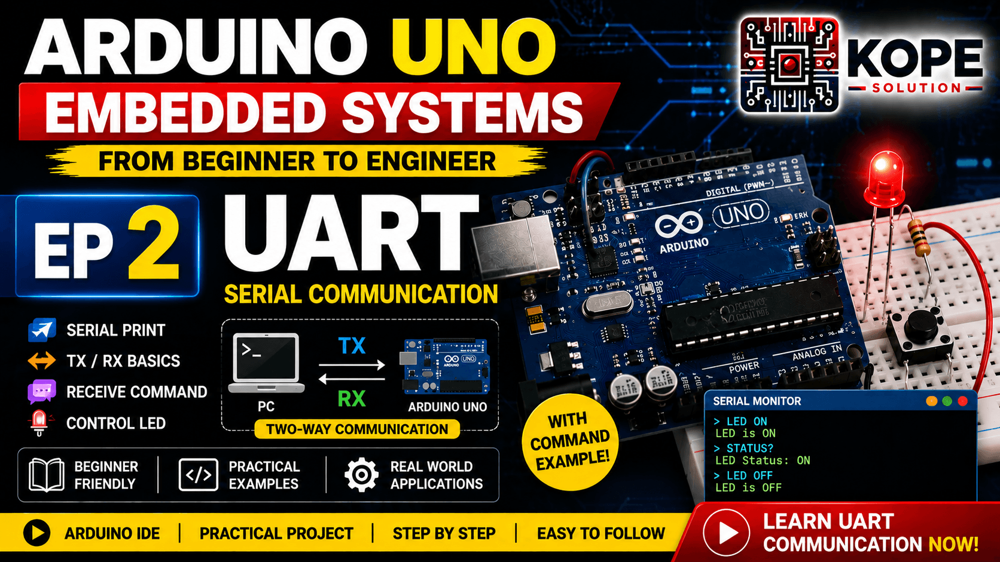
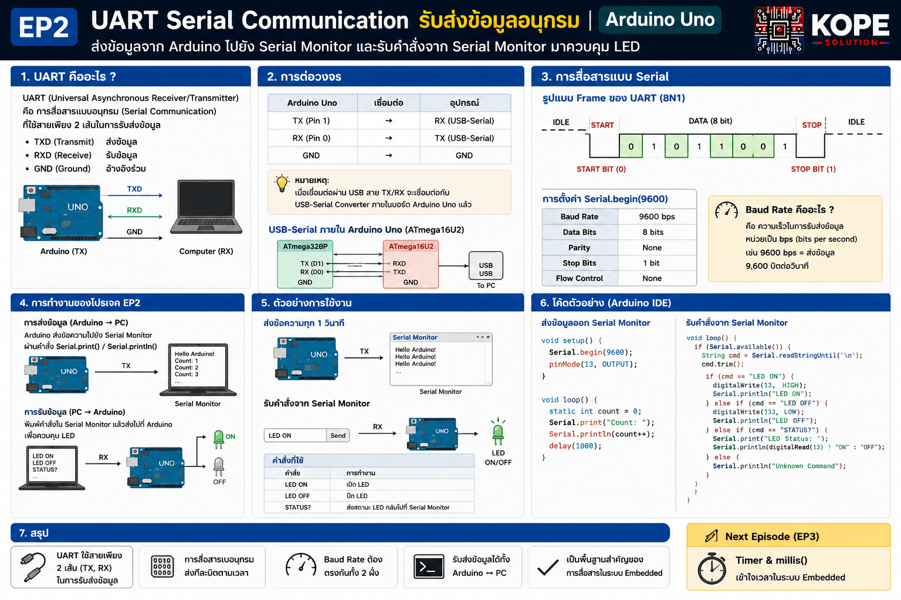

# EP02 — UART Serial Communication 🔥

Learn the fundamentals of UART serial communication using Arduino Uno.



---

# Topics

* UART Communication
* TX and RX
* Serial.begin()
* Serial.print()
* Serial.println()
* Serial.available()
* Serial.read()
* Serial Monitor
* Embedded Debugging Fundamentals
* Bidirectional Communication

---

# Why UART Is Important

UART is one of the most important communication protocols in embedded systems.

UART is used in:

* Debugging
* RS232
* RS485
* Modbus RTU
* GPS Modules
* WiFi Modules
* PLC Communication
* Industrial Devices



---

# Hardware

| Component   | Quantity |
| ----------- | -------- |
| Arduino Uno | 1        |
| USB Cable   | 1        |
| PC / Laptop | 1        |
| LED         | 1        |

---

# Arduino Code

In this episode, the code examples are divided into 2 parts:

1. Send data from Arduino Uno to Serial Monitor
2. Receive commands from Serial Monitor to control LED

---

# Code Example 1 — Send Data to Serial Monitor

This example sends serial messages from Arduino Uno to the PC every 1 second.

```cpp
void setup(){
    Serial.begin(9600);

    Serial.println("Hello AVR");
}

void loop(){
    Serial.println("UART Communication Running...");

    delay(1000);
}
```

---

# Code Example 2 — Receive Command from Serial Monitor

This example receives commands from the Serial Monitor and controls the onboard LED.

Commands:

```text
LED ON
LED OFF
STATUS?
```

```cpp
const int ledPin = 13;

void setup(){
    Serial.begin(9600);

    pinMode(ledPin, OUTPUT);

    Serial.println("UART Command Ready");
    Serial.println("Commands: LED ON, LED OFF, STATUS?");
}

void loop(){
    if (Serial.available() > 0){

        String cmd = Serial.readStringUntil('\n');

        cmd.trim();

        if (cmd == "LED ON"){

            digitalWrite(ledPin, HIGH);

            Serial.println("LED is ON");

        }else if (cmd == "LED OFF"){

            digitalWrite(ledPin, LOW);

            Serial.println("LED is OFF");

        }else if (cmd == "STATUS?"){

            Serial.print("LED Status: ");

            if (digitalRead(ledPin) == HIGH){

                Serial.println("ON");

            }else{

                Serial.println("OFF");
            }

        }else{

            Serial.println("Unknown Command");
        }
    }
}
```

---

# How To Test

## Example 1

1. Upload Code Example 1
2. Open Serial Monitor
3. Set baud rate to `9600`
4. Observe serial messages every 1 second

Example output:

```text
Hello AVR
UART Communication Running...
UART Communication Running...
UART Communication Running...
```

---

## Example 2

1. Upload Code Example 2
2. Open Serial Monitor
3. Set baud rate to `9600`
4. Set line ending to `Newline`
5. Send commands:

```text
LED ON
LED OFF
STATUS?
```

The onboard LED on Pin 13 will respond based on the received command.

---

# How To Test

1. Upload code to Arduino Uno
2. Open Serial Monitor
3. Set baud rate to 9600
4. Set line ending to "Newline"
5. Send commands:

```text
LED ON
LED OFF
STATUS?
```

---

# Example Communication

```text
PC → Arduino

LED ON
```

```text
Arduino → PC

LED ON
```

---

# Concepts Learned

* UART Basics
* Serial Communication
* TX/RX
* Embedded Debugging
* Bidirectional Communication
* Command Parsing
* Serial Monitor Interaction

---

# Why This EP Is Important

This episode introduces real communication between:

* PC ↔ Arduino
* Device ↔ Device
* Embedded ↔ Industrial Systems

This is the foundation of:

* RS232
* RS485
* Modbus RTU
* PLC Communication
* SCADA Systems
* IoT Gateways

---

# Next Episode

➡ EP03 — Timer Basics

---

# GitHub Repository

https://github.com/KOPE-SOLUTION/arduino-uno-embedded-roadmap
