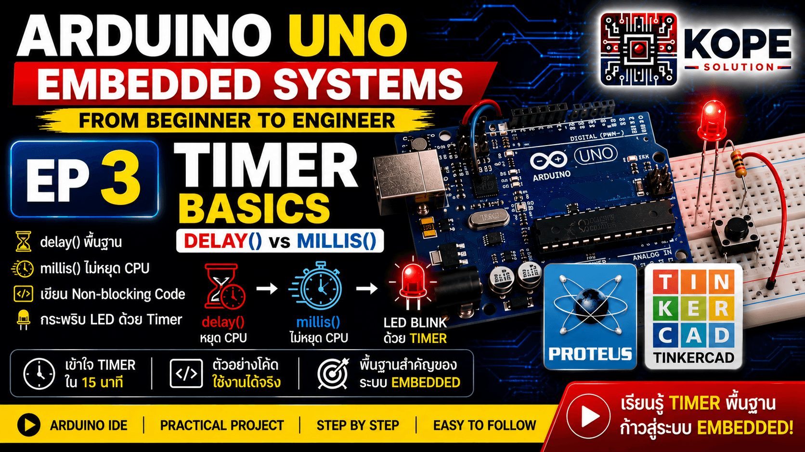

# EP03 — Timer Basics



เรียนรู้พื้นฐานของ Timer ใน Arduino Uno และ Embedded Systems

---

# EP นี้สำคัญยังไง?

Timer คือหนึ่งใน Peripheral ที่สำคัญที่สุดของ Microcontroller

แม้แต่ฟังก์ชันพื้นฐานอย่าง:

```cpp id="9m1h0l"
delay()
millis()
analogWrite()
```

ก็ทำงานอยู่บน Timer ภายใน MCU

ถ้าเริ่มเข้าใจ Timer:

* จะเริ่มเข้าใจการทำงานของ MCU จริง
* เข้าใจระบบ Real-time
* เข้าใจ Non-blocking Programming
* และต่อยอดไปยัง Interrupt, PWM, RTOS และ Industrial Systems ได้ง่ายขึ้น

---

# Topics

* delay()
* millis()
* Non-blocking code
* Timer Basics
* LED Blink using Timer
* Embedded Timing Fundamentals

---

# ทำไม Timer ถึงสำคัญ?

Timer ถูกใช้แทบทุกระบบใน Embedded Systems เช่น:
* Real-time Systems
* PWM
* Interrupts
* Scheduling
* Communication Protocols
* Sensor Sampling
* Industrial Automation
* PLC Timing Logic
* IoT Devices

---

# Hardware

| Component     | Quantity |
| ------------- | -------- |
| Arduino Uno   | 1        |
| LED           | 1        |
| Resistor 220Ω | 1        |
| USB Cable     | 1        |

---

# Code Example 1 — Basic delay()

ตัวอย่างแรกนี้ใช้ `delay()` เพื่อกระพริบ LED

```cpp id="n3xktv"
const int ledPin = 13;

void setup(){
    pinMode(ledPin, OUTPUT);
}

void loop(){

    digitalWrite(ledPin, HIGH);

    delay(1000);

    digitalWrite(ledPin, LOW);

    delay(1000);
}
```

---

# delay() ทำงานยังไง?

```cpp id="w0brlk"
delay(1000);
```

หมายถึง:

```text id="nru0fo"
หยุด CPU ไว้ 1000 ms
```

ระหว่างนั้น:

* CPU จะรอ
* โค้ดส่วนอื่นไม่ทำงาน
* ระบบตอบสนองช้าลง

---

# ปัญหาของ delay()

แม้ `delay()` จะใช้ง่าย แต่มีข้อเสียสำคัญ:

❌ block CPU <br>
❌ ทำ multitasking ยาก <br>
❌ communication อาจสะดุด <br>
❌ ระบบไม่ responsive <br>
❌ ไม่เหมาะกับระบบ real-time

---

# ตัวอย่างปัญหาจริง

สมมติระบบมี:

* อ่าน Sensor
* รับ UART
* ควบคุม Relay
* ส่ง MQTT

ถ้าใช้:

```cpp id="dsh0fg"
delay(5000);
```

ระบบจะ "หยุดรอ" 5 วินาทีทันที 

ระหว่างนั้น:

* UART อาจพลาดข้อมูล
* Sensor ไม่ถูกอ่าน
* Relay ไม่ตอบสนอง
* ระบบดูหน่วง

นี่คือเหตุผลที่ระบบ Embedded จริงพยายามหลีกเลี่ยง `delay()`

---

# Code Example 2 — Timer using millis()

ตัวอย่างนี้ใช้ `millis()` เพื่อทำงานแบบ Non-blocking

```cpp id="gj7l5o"
const int ledPin = 13;

unsigned long previousMillis = 0;

const long interval = 1000;

void setup(){
    pinMode(ledPin, OUTPUT);
}

void loop(){

    unsigned long currentMillis = millis();

    if (currentMillis - previousMillis >= interval){

        previousMillis = currentMillis;

        digitalWrite(ledPin, !digitalRead(ledPin));
    }
}
```

---

# millis() คืออะไร?

```cpp id="ul2k7m"
millis()
```

คือฟังก์ชันที่คืนค่า:

* เวลาที่ MCU ทำงานมาแล้ว
* หน่วยเป็น millisecond

เช่น:

```text id="ol3lzh"
1000 = 1 วินาที
5000 = 5 วินาที
```

---

# ทำไม millis() ดีกว่า?

millis():
- ไม่ block CPU
- ทำ multitasking ได้
- ระบบ responsive มากขึ้น
- เหมาะกับระบบ real-time
- ต่อยอดไป RTOS และ Firmware จริงได้ง่าย

---

# แนวคิดสำคัญ

แทนที่จะ:

```text id="v8h7eo"
"หยุดรอเวลา"
```

ระบบจะเปลี่ยนเป็น:

```text id="lk4c55"
"เช็กว่าเวลาถึงหรือยัง"
```

นี่คือ mindset สำคัญของ Embedded Systems จริง

---

# Concepts Learned

* Timer Basics
* delay()
* millis()
* Non-blocking Programming
* Embedded Timing
* Real-time Concepts

---

# Real-World Applications

* Traffic Light Controller
* Sensor Sampling
* PLC Logic Timing
* IoT Scheduling
* Industrial Automation
* Data Logging
* Communication Timing

---

# Next Episode

➡ EP04 — Interrupt Basics

---

# GitHub Repository

https://github.com/KOPE-SOLUTION/arduino-uno-embedded-roadmap
