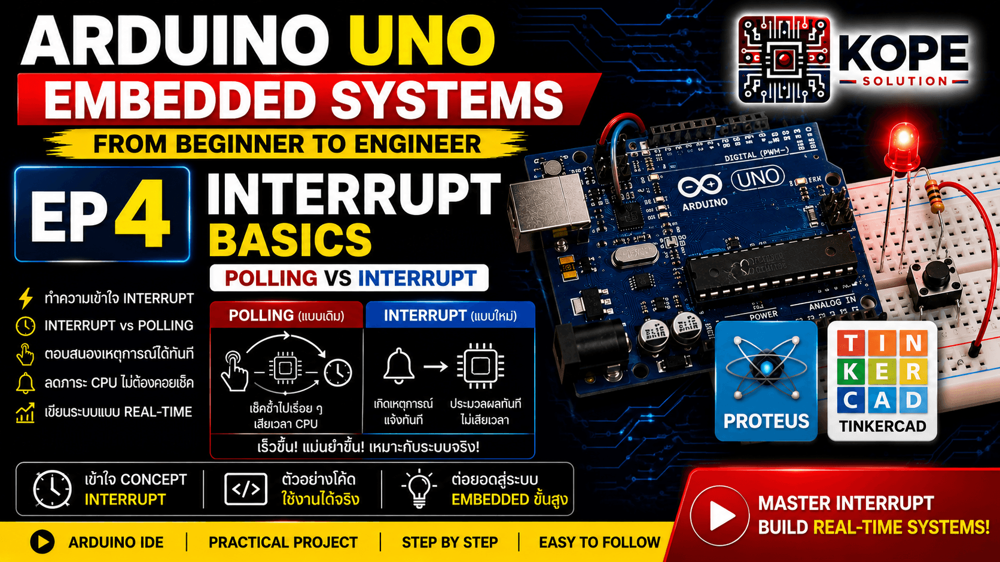

# EP04 — Interrupt Basics

เรียนรู้พื้นฐานของ Interrupt ใน Arduino Uno และ Embedded Systems



---

# Interrupt คืออะไร?

Interrupt คือกลไกที่ทำให้ MCU หยุดงานปัจจุบันชั่วคราว เพื่อไปตอบสนองเหตุการณ์สำคัญทันที

เช่น:
- ปุ่มถูกกด
- Sensor Trigger
- Encoder หมุน
- มีข้อมูล UART เข้า
- Timer หมดเวลา

เมื่อจัดการเสร็จ MCU จะกลับมาทำงานเดิมต่อ

---

# ทำไม Interrupt ถึงสำคัญ?

ถ้าไม่มี Interrupt: MCU ต้องคอยตรวจสอบทุกอย่างตลอดเวลา เรียกว่า: Polling

ซึ่ง:
- เปลือง CPU
- ตอบสนองช้า
- พลาด event ได้ง่าย

<br>

Interrupt ช่วยให้ระบบ:
- ตอบสนองเร็ว
- Real-time มากขึ้น
- ประหยัด CPU
- รองรับหลายงานพร้อมกัน

---

# Topics

- Interrupt Basics
- attachInterrupt()
- ISR
- Rising Edge
- Falling Edge
- Real-time Concepts
- Event-driven Programming

---

# Hardware

| Component | Quantity |
|---|---|
| Arduino Uno | 1 |
| Push Button | 1 |
| LED | 1 |
| Resistor 220Ω | 1 |
| Breadboard | 1 |

---

# Code Example 1 — Basic Polling

ตัวอย่างนี้ MCU จะคอยเช็กปุ่มตลอดเวลา

```cpp
const int ledPin = 13;
const int buttonPin = 2;

void setup(){
  pinMode(ledPin, OUTPUT);
  pinMode(buttonPin, INPUT_PULLUP);
}

void loop(){
  if (digitalRead(buttonPin) == LOW){
    digitalWrite(ledPin, HIGH);
  }else{
    digitalWrite(ledPin, LOW);
  }
}
```

---

# ปัญหาของ Polling

แม้ Polling จะใช้ง่าย แต่:
- CPU ต้องเช็กตลอดเวลา
- ถ้ามี delay() อาจพลาด event
- ระบบใหญ่จะเริ่มช้า
- ไม่เหมาะกับ Real-time มากนัก

---

# Code Example 2 — Interrupt Basics

ตัวอย่างนี้ใช้ Interrupt เพื่อจับการกดปุ่ม

```cpp
const int ledPin = 13;
const int buttonPin = 2;

volatile bool ledState = false;

void setup(){
  pinMode(ledPin, OUTPUT);
  pinMode(buttonPin, INPUT_PULLUP);

  attachInterrupt(
    digitalPinToInterrupt(buttonPin),
    buttonISR,
    FALLING
  );
}

void loop(){
  digitalWrite(ledPin, ledState);
}

void buttonISR(){
  ledState = !ledState;
}
```

---

# attachInterrupt()

ใช้สำหรับเปิดใช้งาน Interrupt

```cpp
attachInterrupt(
  digitalPinToInterrupt(buttonPin),
  buttonISR,
  FALLING
);
```

---

# FALLING คืออะไร?

หมายถึง: `HIGH → LOW`

ในวงจร INPUT_PULLUP:
- ปล่อยปุ่ม = HIGH
- กดปุ่ม = LOW

ดังนั้น: การกดปุ่มจะเกิด Falling Edge

---

# ISR คืออะไร?

ISR ย่อมาจาก: Interrupt Service Routine คือ ฟังก์ชันที่ MCU จะกระโดดไปทำทันที เมื่อเกิด Interrupt

```cpp
void buttonISR(){
  ledState = !ledState;
}
```

---

# volatile คืออะไร?

```cpp
volatile bool ledState = false;
```

volatile บอก compiler ว่า: ค่าตัวแปรนี้อาจถูกเปลี่ยนจากภายนอก เช่น Interrupt

---

# Interrupt สำคัญกับอะไรบ้าง?

Interrupt ถูกใช้ใน:
- Encoder
- UART RX
- PWM
- Timer
- PLC Input
- Industrial Sensor
- Emergency Stop
- High-speed Counter

---

# Concepts Learned

- Interrupt Basics
- ISR
- Event-driven Programming
- Real-time Concepts
- Polling vs Interrupt
- Rising/Falling Edge

---

# Real-World Applications

- Emergency Stop
- Encoder Reading
- Sensor Trigger
- PLC Digital Input
- Motor Control
- Industrial Automation

---

# Next Episode

➡ EP05 — PWM Basics

---

# GitHub Repository

https://github.com/KOPE-SOLUTION/arduino-uno-embedded-roadmap
