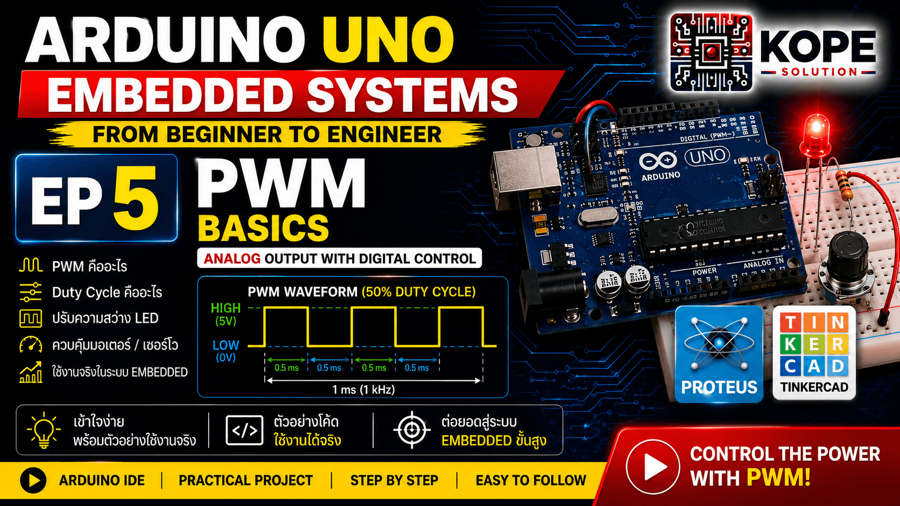
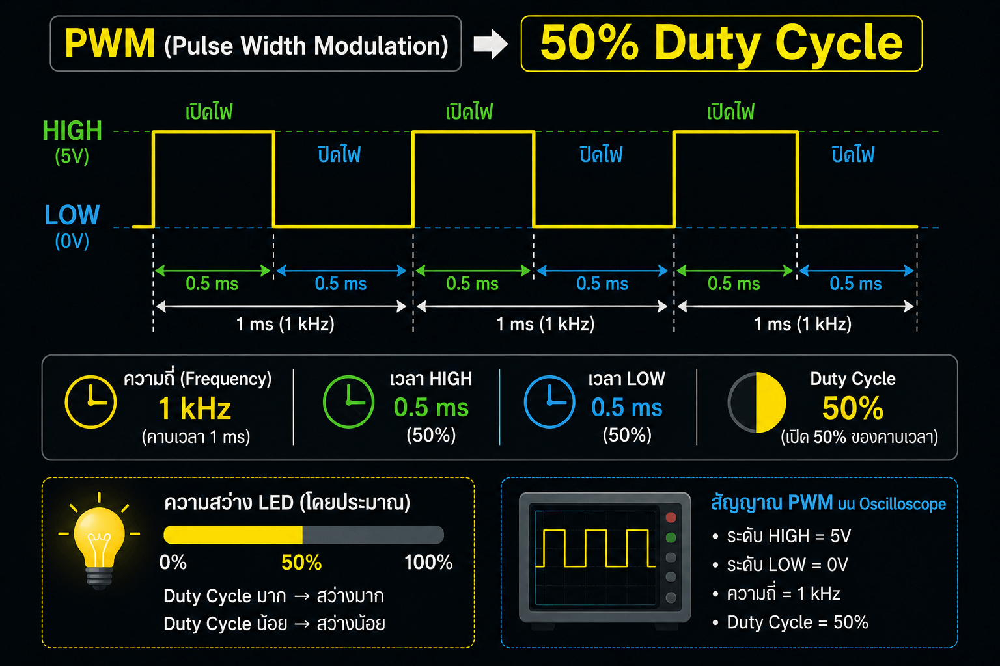

# EP05 — PWM Basics

เรียนรู้พื้นฐานของ PWM ใน Arduino Uno และ Embedded Systems



---

# PWM คืออะไร?

PWM ย่อมาจาก: Pulse Width Modulation คือ การสร้างสัญญาณ Digital ที่เปิดและปิดเร็วมาก เพื่อจำลองค่า Analog

แม้ Arduino Uno จะไม่มี DAC จริง แต่ PWM สามารถทำให้:
- LED ดูเหมือนหรี่แสงได้
- มอเตอร์หมุนเร็วช้าต่างกันได้
- ควบคุมกำลังไฟฟ้าได้

---

# แนวคิดสำคัญ

PWM ไม่ได้เปลี่ยนแรงดันจริง แต่เปลี่ยน: ระยะเวลา HIGH และ LOW

เช่น:
- HIGH นาน → พลังงานมาก
- LOW นาน → พลังงานน้อย

---

# Topics

- PWM Basics
- analogWrite()
- Duty Cycle
- LED Brightness Control
- PWM Frequency
- Embedded PWM Concepts

---

# ทำไม PWM ถึงสำคัญ?

PWM ถูกใช้แทบทุกระบบใน Embedded Systems เช่น:
- LED Dimmer
- Motor Speed Control
- Fan Control
- Servo Motor
- Power Electronics
- Industrial Automation
- Embedded Control Systems

---

# Hardware

| Component | Quantity |
|---|---|
| Arduino Uno | 1 |
| LED | 1 |
| Resistor 220Ω | 1 |
| Breadboard | 1 |

---

# PWM Pins ใน Arduino Uno

PWM Pins: 3, 5, 6, 9, 10, 11 บนบอร์ดจะมีสัญลักษณ์: `~` กำกับไว้

---

# Code Example 1 — Basic PWM

ตัวอย่างนี้ควบคุมความสว่าง LED

```cpp
const int ledPin = 9;

void setup(){
  pinMode(ledPin, OUTPUT);
}

void loop(){
  analogWrite(ledPin, 50);
}
```

---

# analogWrite() คืออะไร?

```cpp
analogWrite(pin, value);
```

ใช้สร้าง PWM Signal ค่า: `0 - 255` โดย:
- 0 = ดับ
- 255 = สว่างสุด

---

# Duty Cycle คืออะไร?

Duty Cycle คือ: เปอร์เซ็นต์เวลาที่สัญญาณเป็น HIGH

ตัวอย่าง:
- 50% = HIGH ครึ่งหนึ่ง
- 75% = HIGH นานกว่า LOW
- 10% = HIGH สั้นมาก

---

# Visualization



---

# Code Example 2 — Fade LED

ตัวอย่างนี้ค่อย ๆ เพิ่มและลดความสว่าง LED

```cpp
const int ledPin = 9;
int brightness = 0;
int fadeAmount = 5;

void setup(){
  pinMode(ledPin, OUTPUT);
}

void loop(){
  analogWrite(ledPin, brightness);
  brightness = brightness + fadeAmount;
  if (brightness <= 0 || brightness >= 255){
    fadeAmount = -fadeAmount;
  }
  delay(30);
}
```

---

# ทำไม PWM สำคัญกับ Embedded Systems?

PWM คือพื้นฐานของ:
- Motor Driver
- Inverter
- Servo Control
- BLDC Control
- Industrial Automation
- Power Electronics

<br>

แม้แต่ระบบ:
- EV
- Solar Inverter
- Industrial Motor

ก็ใช้ PWM

---

# Concepts Learned

- PWM Basics
- analogWrite()
- Duty Cycle
- LED Brightness Control
- Embedded PWM Concepts

---

# Analog Output vs PWM

แม้ Arduino Uno จะไม่มี DAC จริง และ `analogWrite()` จะใช้ PWM แทน Analog จริง

แต่ในโลก Embedded Systems จริง **ทั้ง PWM และ DAC ยังถูกใช้งานจริงทั้งคู่** โดยแต่ละแบบเหมาะกับงานต่างกัน

## PWM เหมาะกับงานอะไร?

PWM ถูกใช้เยอะมากในงาน:
- LED Dimmer
- Motor Speed Control
- Fan Controller
- Servo Control
- Industrial Automation
- Power Electronics
- Inverter
- EV Motor Control

<br>

เหตุผลสำคัญคือ:
- PWM มีประสิทธิภาพสูง
- สูญเสียพลังงานต่ำ
- เหมาะกับงานกำลังไฟฟ้า

ดังนั้นในโลก Industrial และ Power Electronics **PWM ถูกใช้อย่างแพร่หลายมาก**

## แล้ว Analog จริง (DAC) ใช้กับอะไร?

DAC หรือ Analog Output จริง ยังถูกใช้อยู่ในงานจำนวนมาก โดยเฉพาะงานสัญญาณ (Signal Processing)

### Audio Systems

DAC คือหัวใจของระบบเสียง เช่น:
- Sound Card
- USB DAC
- Bluetooth Speaker
- โทรศัพท์
- เครื่องเสียง

เพราะลำโพงต้องการ Analog Signal จริง

### Function Generator / Oscilloscope

เครื่องสร้างสัญญาณ เช่น:
- Sine Wave
- Triangle Wave
- Sawtooth Wave

ต้องใช้ Analog Voltage จริง

### Industrial 0-10V Control

ในโรงงานยังมีการควบคุมแบบ `0-10V` เช่น:
- Inverter
- Valve Control
- Damper
- Pressure Controller

### 4-20mA Industrial Signal

ระบบอุตสาหกรรมจำนวนมากใช้ `4-20mA Current Loop` เช่น:
- PLC
- SCADA
- Pressure Transmitter
- Flow Meter

โดยต้นทางมักมี DAC ภายในระบบ

### Sensor Simulation

บางระบบต้องจำลอง Sensor เช่น:
- Temperature Sensor
- Pressure Sensor
- Analog Voltage
- Current Signal

จึงต้องใช้ Analog Output จริง

### Reference Voltage

ระบบ:
- ADC
- Calibration
- Measurement

ต้องใช้แรงดันนิ่งและละเอียดสูง DAC จึงมีความสำคัญมาก

### Medical Equipment

เช่น:
- ECG
- EEG
- Signal Generator
- Imaging System

<br>

ระบบเหล่านี้ต้องการ:
- Signal เรียบ
- Noise ต่ำ

PWM จึงไม่เหมาะโดยตรง


---

## โลกจริงมักใช้ทั้ง PWM และ DAC ร่วมกัน

### ตัวอย่าง: Inverter

ภายในระบบอาจมี:
- DAC → สร้าง Reference Signal
- PWM → ใช้ขับกำลังจริง

### ตัวอย่าง: Bluetooth Speaker

เสียงเพลง: ใช้ DAC จริง

แต่ภาคขยายแบบ Class-D: ใช้ PWM ขับลำโพง

---

# สรุปสำคัญ

## PWM

เหมาะกับ:
- งานกำลัง
- Motor
- Power Electronics
- Industrial Control

## DAC

เหมาะกับ:
- งานสัญญาณ
- Audio
- Measurement
- Calibration
- Analog Interface

---

# Next Episode

➡ EP06 — ADC Basics

---

# GitHub Repository

https://github.com/KOPE-SOLUTION/arduino-uno-embedded-roadmap
