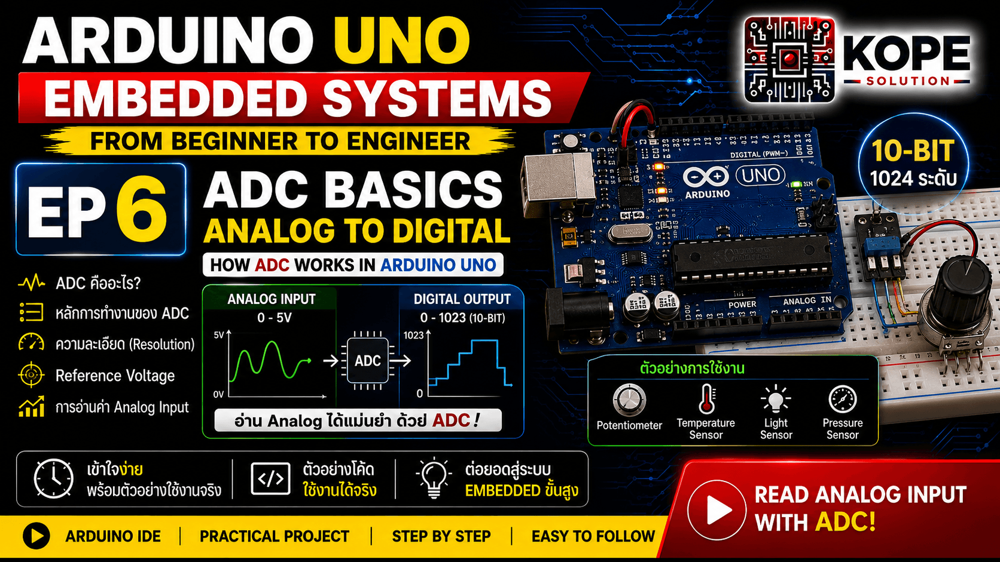
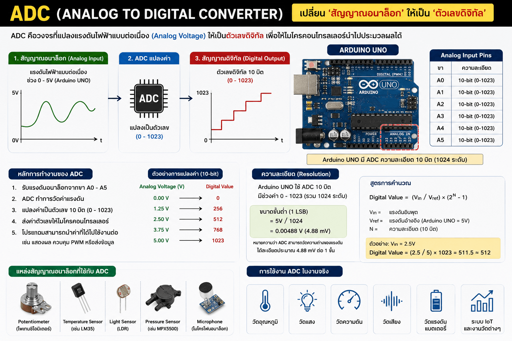

# EP06 — ADC Basics

เรียนรู้พื้นฐานของ ADC (Analog to Digital Converter) ใน Arduino Uno และ Embedded Systems



---

# ADC คืออะไร?

ADC ย่อมาจาก: **Analog to Digital Converter** คือวงจรที่ใช้แปลง `Analog Voltage` ให้กลายเป็น `Digital Value` เพื่อให้ MCU สามารถประมวลผลได้



---

# ทำไม ADC ถึงสำคัญ?

โลกจริงเต็มไปด้วยสัญญาณ Analog เช่น:
- Temperature Sensor
- Potentiometer
- Light Sensor
- Pressure Sensor
- Current Sensor
- Voltage Sensor

แต่ MCU เข้าใจแค่: `0` และ `1` ADC จึงเป็นสะพานเชื่อมระหว่าง:
- โลก Analog
- และ Digital Systems

---

# Topics

- ADC Basics
- analogRead()
- Analog Voltage
- Resolution
- ADC Mapping
- Sensor Reading
- Embedded Measurement Concepts

---

# Hardware

| Component | Quantity |
|---|---|
| Arduino Uno | 1 |
| Potentiometer | 1 |
| Breadboard | 1 |
| Jumper Wire | 3 |

---

# Analog Pins

Arduino Uno มี Analog Input: `A0 - A5` ใช้สำหรับอ่าน Analog Voltage

---

# ADC Resolution

ADC ของ Arduino Uno มีความละเอียด `10-bit` หมายความว่า `0 - 1023` รวมทั้งหมด `1024 ระดับ`

---

# ADC Voltage Range

โดยปกติ Arduino Uno ใช้: `0V - 5V`

ดังนั้น:

| Voltage | ADC Value |
|---|---|
| 0V | 0 |
| 2.5V | ~512 |
| 5V | 1023 |

---

# Code Example 1 — Basic ADC Reading

ตัวอย่างนี้อ่านค่าจาก Potentiometer

```cpp
const int analogPin = A0;

int sensorValue = 0;

void setup(){
  Serial.begin(9600);
}

void loop(){
  sensorValue = analogRead(analogPin);
  Serial.println(sensorValue);

  delay(500);
}
```

---

# analogRead() คืออะไร?

```cpp
analogRead(pin);
```

ใช้สำหรับอ่านค่า ADC ค่าที่ได้ `0 - 1023`

---

# การทำงานจริง

เมื่อหมุน Potentiometer:
- แรงดันเปลี่ยน
- ADC แปลงแรงดัน
- MCU ได้ค่า Digital

<br>

เช่น:
1.2V → 245
2.5V → 512
4.7V → 962

---

# Code Example 2 — ADC + LED Brightness

ตัวอย่างนี้ใช้ Potentiometer ควบคุมความสว่าง LED

```cpp
const int analogPin = A0;
const int ledPin = 9;
int sensorValue = 0;
int pwmValue = 0;

void setup(){
  Serial.begin(9600);
}

void loop(){
  sensorValue = analogRead(analogPin);
  pwmValue = map(sensorValue, 0, 1023, 0, 255);

  analogWrite(ledPin, pwmValue);

  Serial.print("ADC: ");
  Serial.print(sensorValue);
  Serial.print(" | PWM: ");
  Serial.println(pwmValue);

  delay(100);
}
```

---

# map() คืออะไร?

```cpp
map(value, fromLow, fromHigh, toLow, toHigh);
```

ใช้แปลงช่วงค่า เช่น: `0-1023 → 0-255`

เพราะ:
- ADC = 10-bit
- PWM = 8-bit

---

# ADC สำคัญกับอะไรบ้าง?

ADC ถูกใช้ใน:
- Sensor Systems
- Industrial Measurement
- IoT Devices
- Battery Monitoring
- Solar Monitoring
- Data Acquisition
- Medical Devices
- Automation Systems

---

# โลกจริงใช้ ADC เยอะมาก

เช่น:
- Temperature Monitoring
- Current Measurement
- Pressure Monitoring
- Industrial Transmitter
- Smart Sensors
- Data Logger

---

# Concepts Learned

- ADC Basics
- analogRead()
- Analog Voltage
- Resolution
- Mapping
- Sensor Reading
- Embedded Measurement

---

# Real-World Applications

- Temperature Sensor
- Light Sensor
- Potentiometer
- Battery Monitoring
- Industrial Sensors
- IoT Monitoring
- Data Logger

---

# Next Episode

➡ EP07 — SPI Basics

---

# GitHub Repository

https://github.com/KOPE-SOLUTION/arduino-uno-embedded-roadmap
