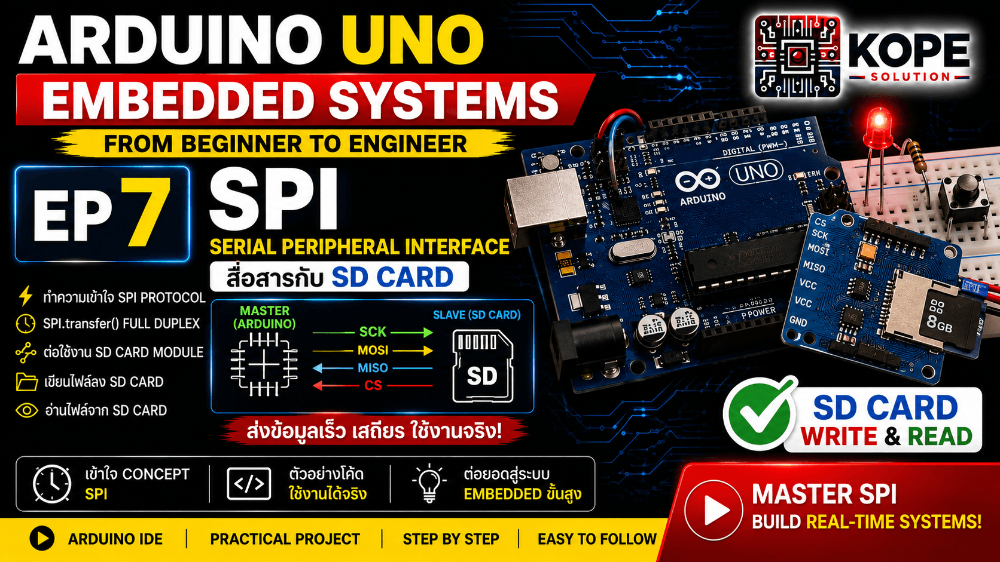
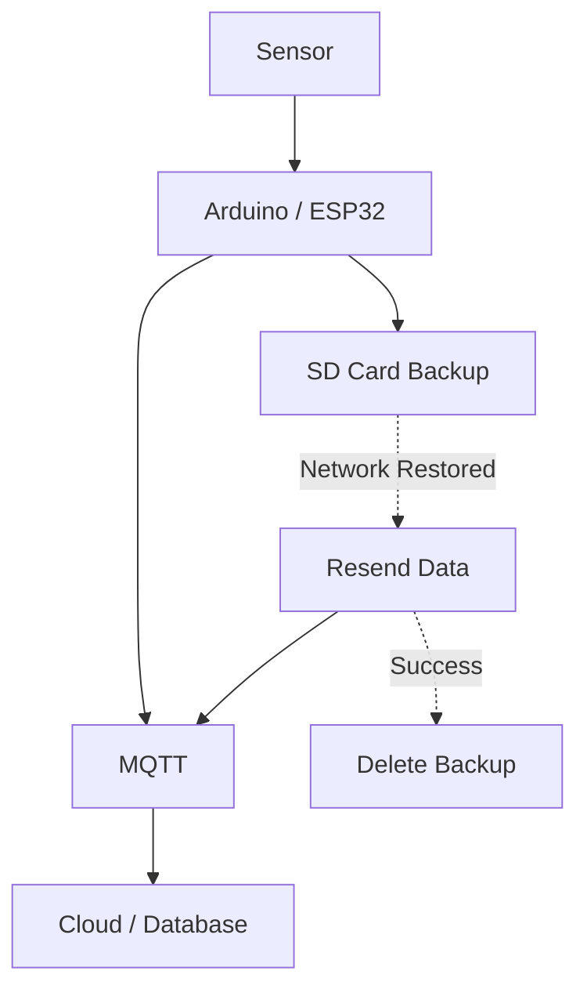

# EP07 — SPI Communication + SD Card Logger



เรียนรู้พื้นฐานของ SPI (Serial Peripheral Interface) ผ่าน Arduino Uno และทดลองใช้งานจริงกับ SD Card Module

EP นี้ออกแบบให้เรียนรู้ตั้งแต่ Concept จนถึงการใช้งานจริงในคลิปเดียว

```text
SPI Concept → SPI Bus → SD Card Module → Write File → Read File
```

---

# SPI คืออะไร?

SPI (Serial Peripheral Interface) คือ Protocol สำหรับสื่อสารข้อมูลแบบ Serial ระหว่าง MCU กับ Peripheral อุปกรณ์ที่นิยมใช้ SPI:
- SD Card Module
- TFT LCD
- OLED Display
- Ethernet Module
- LoRa Module
- EEPROM
- ADC / DAC ภายนอก

---

# ทำไม SPI ถึงสำคัญ?

SPI เป็นหนึ่งใน Protocol ที่ได้รับความนิยมมากใน Embedded Systems เพราะ:
- ความเร็วสูง
- Full Duplex (ส่งและรับพร้อมกัน)
- เหมาะกับ Display และ Storage
- Latency ต่ำ
- ใช้งานจริงในระบบ IoT และ Industrial

---

# SPI Signal หลัก

| Signal | ความหมาย | Arduino Uno |
|---|---|---|
| MOSI | Master Out Slave In | D11 |
| MISO | Master In Slave Out | D12 |
| SCK | Serial Clock | D13 |
| CS | Chip Select | D10 |

---

# SPI Bus ใช้อุปกรณ์หลายตัวได้ไหม?

ได้ SPI สามารถแชร์สาย:
- MOSI
- MISO
- SCK

ร่วมกันได้ แต่ต้องแยก:

```text
CS (Chip Select)
```

สำหรับแต่ละอุปกรณ์ ตัวอย่าง:

| Device | CS |
|---|---|
| SD Card | D10 |
| TFT LCD | D9 |
| Ethernet Module | D8 |

---

# ข้อดีของ SPI

- เร็วกว่า UART
- เร็วกว่า I2C
- Full Duplex
- เหมาะกับข้อมูลจำนวนมาก
- เหมาะกับ Storage และ Display

---

# ข้อจำกัดของ SPI

- ใช้สายมากกว่า I2C
- ต้องใช้ CS แยก
- ใช้ GPIO มากขึ้นเมื่อมีหลายอุปกรณ์

---

# เปรียบเทียบ SPI vs UART vs I2C

| Protocol | จุดเด่น | เหมาะกับ |
|---|---|---|
| UART | ใช้งานง่าย | Debug, GPS, RS485 |
| I2C | ใช้สาย 2 เส้น | Sensor, RTC |
| SPI | เร็วมาก | SD Card, TFT, Ethernet |

---

# Hardware

| Component | Quantity |
|---|---|
| Arduino Uno | 1 |
| SD Card Module | 1 |
| MicroSD Card | 1 |

---

# Format SD Card

แนะนำ:
```text
FAT32
```

ขนาดที่เหมาะสม:
```text
4GB - 32GB
```

---

# Wiring

| SD Card Module | Arduino Uno |
|---|---|
| VCC | 5V |
| GND | GND |
| CS | D10 |
| MOSI | D11 |
| MISO | D12 |
| SCK | D13 |

---

# Code Example — SD Card Write File


```cpp
#include <SPI.h>
#include <SD.h>

const int chipSelect = 10;

void setup() {

  Serial.begin(9600);

  delay(1000);

  Serial.println("Initializing SD card...");

  if (!SD.begin(chipSelect)) {
    Serial.println("SD card initialization failed!");
    return;
  }

  Serial.println("SD card initialized.");

  File myFile = SD.open("test.txt", FILE_WRITE);

  if (myFile) {
    myFile.println("SOLO KOPE");
    myFile.close();
    Serial.println("Write success.");
  }
}

void loop() {
}
```


<br>

ผลลัพธ์:

```text
Initializing SD card...
SD card initialized.
Write success.
```

---

# Code Example — SD Card Write & Read File

```cpp
#include <SPI.h>
#include <SD.h>

const int chipSelect = 10;

void setup() {

  Serial.begin(9600);

  delay(1000);

  if (!SD.begin(chipSelect)) {
    return;
  }

  File myFile = SD.open("test.txt", FILE_WRITE);

  if (myFile) {

    myFile.println("Hello SPI SD Card");

    myFile.close();
  }

  myFile = SD.open("test.txt");

  if (myFile) {

    while (myFile.available()) {

      Serial.write(myFile.read());
    }

    myFile.close();
  }
}

void loop() {
}
```


---

# Real-World Applications

- IoT Gateway
- Smart Farm
- Environmental Monitoring
- Energy Monitoring
- Industrial Monitoring
- Edge Computing
- Backup Storage

ตัวอย่างการใช้งานจริง:



เมื่ออินเทอร์เน็ตใช้งานได้: `Sensor Data --> MQTT Broker --> Cloud Database`
แต่หากอินเทอร์เน็ตหรือ MQTT Broker ไม่พร้อมใช้งาน: `Sensor Data --> SD Card Backup`
เมื่อระบบกลับมาออนไลน์: `SD Card --> Resend Data --> MQTT Broker --> Database`
หลังจากส่งข้อมูลสำเร็จ: `Delete Local Backup`

<br>

แนวคิดนี้เรียกว่า:
- Store and Forward
- Edge Buffer
- Offline Data Logging
- Resilient IoT Architecture

ซึ่งถูกใช้งานจริงใน:
- Smart Farm
- Weather Station
- Industrial IoT
- Energy Monitoring
- Remote Monitoring System

---

# Concepts Learned

- SPI Communication
- MOSI / MISO / SCK / CS
- SPI Bus
- SD Card Module
- Write File
- Read File
- Embedded Storage
- Data Logger

---

# Next Episode

➡ EP08 — I2C Basics

---

# GitHub Repository

https://github.com/KOPE-SOLUTION/arduino-uno-embedded-roadmap
