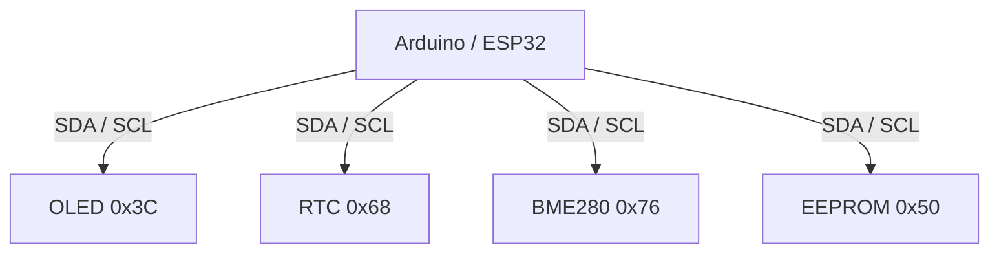

# EP08 — I2C Communication + OLED Display

เรียนรู้พื้นฐานของ I2C ผ่าน Arduino Uno และ OLED SH1106

## I2C คืออะไร?
I2C คือ Protocol สำหรับการสื่อสารแบบ Serial ที่ใช้สายเพียง 2 เส้น (SDA, SCL) และรองรับการเชื่อมต่ออุปกรณ์หลายตัวบน Bus เดียวกัน

## Hardware
- Arduino Uno
- OLED SH1106 I2C
- Jumper Wire

## Wiring
| OLED | Arduino Uno |
|---|---|
| VCC | 5V |
| GND | GND |
| SDA | A4 |
| SCL | A5 |

## Code Example 1 — I2C Scanner

```cpp
#include <Wire.h>

void setup(){
    Wire.begin();
    Serial.begin(9600);
}

void loop(){
    for(byte address=1; address<127; address++){
        Wire.beginTransmission(address);
        if(Wire.endTransmission()==0){
            Serial.print("Found: 0x");
            Serial.println(address,HEX);
        }
    }
    delay(5000);
}
```

## Code Example 2 — OLED Hello World

```cpp
#include <Wire.h>
#include <Adafruit_GFX.h>
#include <Adafruit_SH110X.h>

#define OLED_ADDR 0x3C
Adafruit_SH1106G display(128,64,&Wire,-1);

void setup(){
    Wire.begin();
    display.begin(OLED_ADDR,true);
    display.clearDisplay();
    display.setTextColor(SH110X_WHITE);
    display.setTextSize(1);
    display.setCursor(0,20);
    display.println("KOPE SOLUTION");
    display.display();
}

void loop(){
}
```

## Real-World Applications



