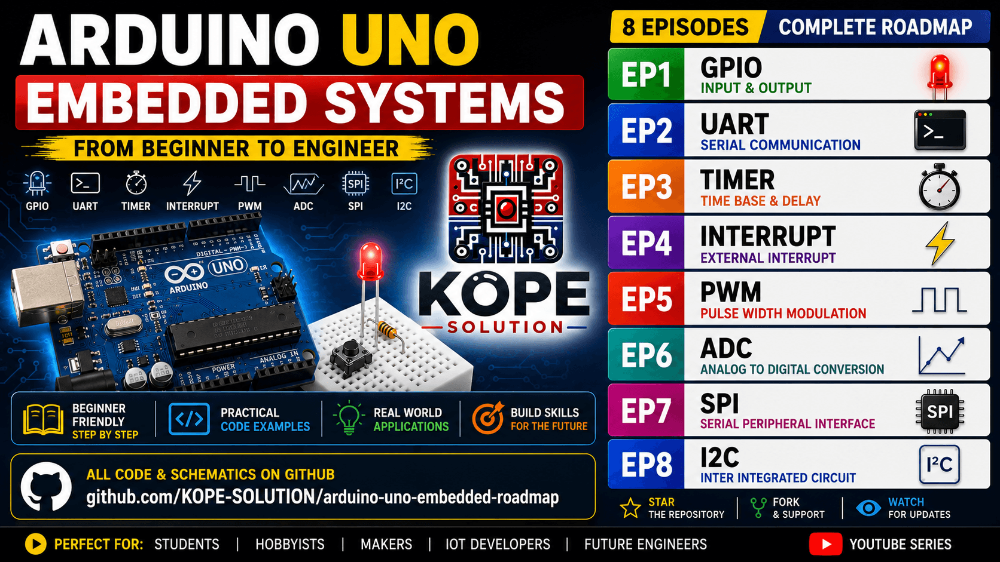

# Arduino Uno Embedded Roadmap

Learn Arduino Uno from beginner to embedded systems engineering.

This repository is designed for:
- Beginners
- IoT Developers
- Embedded Engineers
- Students
- Makers

 

The series teaches:
- GPIO
- UART
- Timer
- Interrupt
- PWM
- ADC
- SPI
- I2C

 

Using:
- Arduino IDE
- ATmega328P
- Embedded Concepts
- Hardware Interface
- Real MCU Fundamentals

---

## YouTube Series

### Foundation Layer

| EP  | Topic     |
| --- | --------- |
| EP1 | [GPIO Input and Output](EP01_GPIO/README.md)      |
| EP2 | [UART Serial Communication](EP02_UART/README.md)      |
| EP3 | [Timer Basic](EP03_TIMER/README.md)     |
| EP4 | [Interrupt Basic](EP04_INTERRUPT/README.md) |

### Control Layer

| EP  | Topic |
| --- | ----- |
| EP5 | [PWM Basic](EP05_PWM/README.md)   |
| EP6 | [ADC Basic](EP06_ADC/README.md)   |

### Communication Layer

| EP  | Topic |
| --- | ----- |
| EP7 | [SPI Communication + SD Card Logger](EP07_SPI/README.md)   |
| EP8 | [I2C Communication + OLED Display](EP08_I2C/README.md)   |

---

## Hardware
- Arduino Uno
- Breadboard
- LED
- Push Button
- Potentiometer
- OLED Display
- Sensors

---

## Why This Series?

This series focuses on understanding:
- how microcontrollers work
- hardware interaction
- embedded systems fundamentals
- real firmware concepts

Not just copying Arduino code.

---

## Future Series
- AVR Bare Metal C
- Register Programming
- ESP32
- STM32
- FreeRTOS
- RS485
- Modbus RTU
- Embedded Linux

